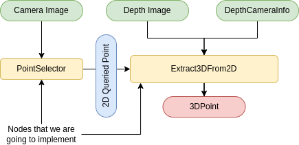

# ROS Tutorial

## In preparation for the tutorial 

### 1. Assure to have all dependencies installed

Go throught [Preparation Checklist](../README.md#preparation-checklist) and assure to have all the packages installed

### 2. Download rosbag file and docker image:

Execute the bash script `download.sh`. The script takes care of downloading the rosbag and the docker image in your laptop

```bash
./download.sh
```

### 3. Create and start the docker container

Enter docker subfolder

```bash
cd docker
```

Launch docker container

  ```bash
  docker compose -f docker-compose-dockerhub.yml up -d
  ```

Open a terminal inside docker once the container has been launched

  ```bash
  docker exec -it aerotrain_perception zsh
  ```

If everything is launched properly, you should be able to run *aerotrain.bag* inside the container.

## Exercises 

### Exercise 1: publisher/subscriber node

This exercise involves the development of a simple publisher/subscriber ROS node. The node will listen to an integer message `/data_in` and publish the sum of the values sent to the node `/data_out`.

### Exercise 2: detection node

This exercise involves developing a target detection algorithm to identify circular target using `HoughCircles` method. The node will listen to the *Camera Image* topic and attempt to detect the target at each time. The node will publish both the center position of the detected circle and an, to prove the detection has been successful, an image showing the detected circle with its center marked.

### Exercise 3: from 2D to 3D

This exercise involves developing a complete pipeline for 2D to 3D point extraction. The yellow nodes will be implemented, consisting of a node that displays the camera image and allows the user to select coordinates using the mouse interface. The 2D coordinates are then sent as a message to the Extract3DFrom2D node, which uses the raw depth image and depth camera information to retrieve the position and orientation of the object in space.
<div align="center">
  
</div>

### Exercise 4: deal with roslaunch 

The exercise 4 builds upon exercise 3, adapting the code to be executed and parameterized using roslaunch. With roslaunch, we can launch multiple nodes from a single file and set parameters that will be read at runtime, either by defining them directly in the launch file or through a separate YAML configuration file.


