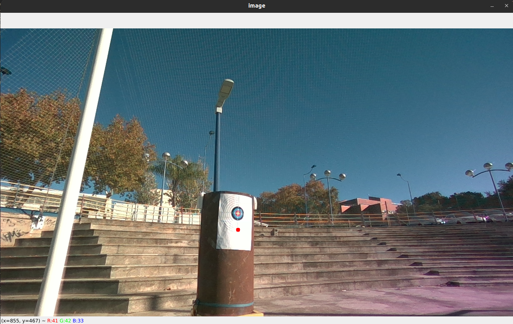

## Run solutions

In order to run solution properly, firstly you need to read and complete Section [In preparation for the tutorial](#in-preparation-for-the-tutorial)

### Start container build catkin workspace 

Go inside container:

```bash
  docker compose -f docker-compose-dockerhub.yml up -d
  docker exec -it aerotrain_perception zsh
```

Build the workspace (inside container)

```bash
  cd /root/catkin_ws
  catkin build -j4
```

### Source workspace and start roscore

Inside container:

```bash
  cd /root/catkin_ws
  source devel/setup.zsh
  roscore
```

### Solution *Exercise 1*

Open a new terminal inside container and launch *publisher_listener*

```bash
  docker exec -it aerotrain_perception zsh
  roslaunch publisher_listener publisher_listener.launch 
```


### Start rosbag

Inside container:

```bash
  cd /root/bag
  rosbag play -l aerotrain_perception.bag 
```

### Solution *Exercise 2*

(Assured to have rosbag *aerotrain_perception* running)\
Open a new terminal inside container and launch *circle_detector*

```bash
  docker exec -it aerotrain_perception zsh
  roslaunch circle_detector circle_detector.launch 
```

### Solution *Exercise 3*

(Assured to have rosbag *aerotrain_perception* running)\
Open a new terminal inside container and launch *start_2d_to_3d*

```bash
  docker exec -it aerotrain_perception zsh
  roslaunch 2d_to_3d start_2d_to_3d.launch
```
At this stage, the camera feedback will pop up:
<div align="center">
  
</div>

By simply clicking on the video feedback, the 3D point extraction is performed. The surrounding points around the selected area are published to the `/point_cloud` topic, while the extracted point is published to the `/retrieved_point` topic. To visualize these topics, it is recommended to use Foxglove, which was installed during the preparation phase.
<div align="center">
  
</div> 


### Solution *Exercise 4*

(Assured to have rosbag *aerotrain_perception* running)\
Open a new terminal inside container and launch *start_2d_to_3d_params*

```bash
  docker exec -it aerotrain_perception zsh
  roslaunch start_2d_to_3d start_2d_to_3d_params.launch 
```
This exercise has the same scope as exercise 3. The main difference lies in the configuration of the nodes, which is done through configuration files.

### Solution Additional exercise

Open a new terminal inside container and launch *circle_detector_laptop_camera*

```bash
  docker exec -it aerotrain_perception zsh
  roslaunch circle_detector circle_detector_laptop_camera.launch 

```
